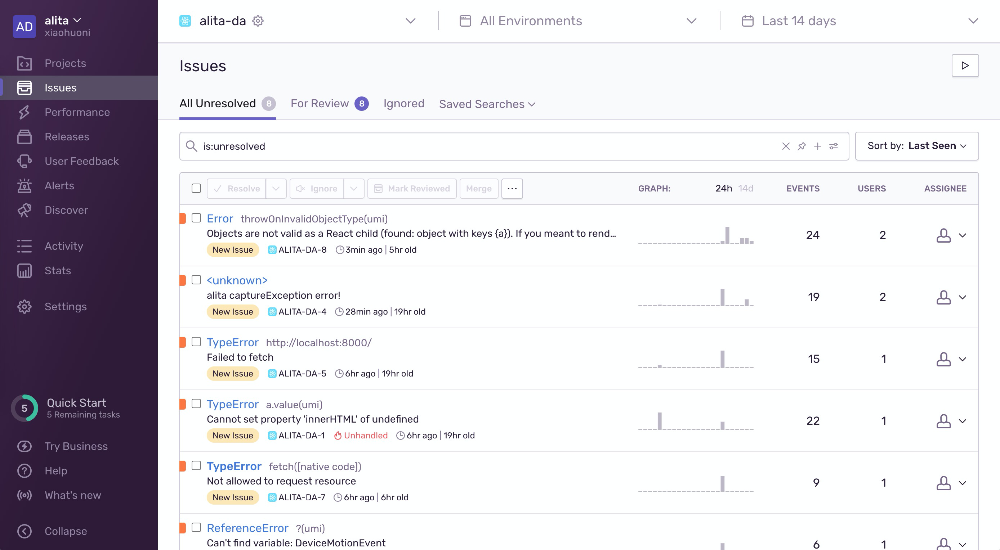
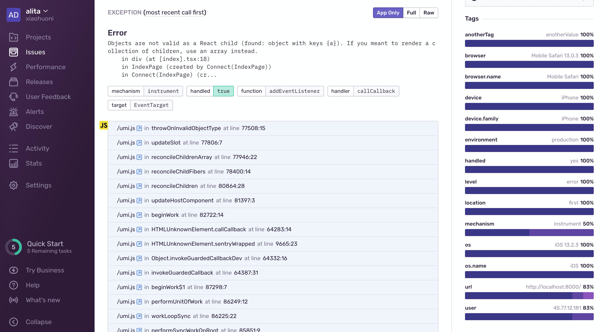

# 如何追踪线上错误

## 前情提要

这个问题从我接手的第一个项目开始就遇到过这个问题，那时候还是在游戏组实习，就听隔壁前端组的大喊大叫，为什么有用户反应又出了什么什么问题，怎么又又用不了了。

程序员小哥很淡定的说：“用户用什么浏览器？怎么重现？”。

这个问题对于程序员来说是比较常见的，可能潜意识里面很难理解，竟然有用户不知道自己用的是什么浏览器。然后客服就去沟通用户。

用户反馈：“啊，不就是手机自带的浏览器！”

程序员：“他用什么手机？什么版本，安卓还是ios，安卓版本多少？发生错误之前都做了什么操作？”

客服：“？”
用户：“？”

有趣的是，这个问题来来回回沟通了两三天时间，最后因为用户用的手机是安卓版本较低的，我们公司找不到重现的机子，最终最开始大喊大叫的经理说，“等找到重现手机再说吧，反正也只有这一个用户遇到这个问题”。

后来如何，我想大家都很清楚了。只要是“等以后在做，后续优化”，那基本上这个需求就是被毙了。

那时候我就在想，是只有那一个手机遇到问题，还是那一系列手机都有问题？只有这一个用户遇到这个问题，是真的只有他遇到问题，还是只有他反馈问题呢？其实做开发的，收到正反馈的机会，会比收到负反馈的机会要少的多。有没有什么方式，能够自动记录下来所有用户遇到的问题呢？然后把程序员需要的数据正确反馈上来？

回到我们的问题上，如何追踪线上的错误？那你知不知道如何追踪本地错误呢？（在不打开控制台，没有 debug 的时候。）

## 如何捕获程序错误？

### 如何捕获js原生错误？

这个算是基本的js的操作了，其实就是监听 window.onerror。 

```html
<!DOCTYPE html>
<html lang="en">

<head>
  <script>
    window.onerror = function (message, source, lineno, colno, exception) {
      console.log(message);
      console.log(source);
      console.log(lineno);
      console.log(colno);
      console.log(exception);
    }
  </script>
  <script>
    var a -1;
  </script>
</head>

<body>
</body>

</html>
```

打开控制台你将看到这样的打印信息。

```txt
Uncaught SyntaxError: Unexpected token '-' 
file:///Users/xiaohuoni/blog/blog/index.html
15
11
SyntaxError: Unexpected token '-'
```

除了常见的语法错误，js 中还提供了一个事件 - [`onunhandledrejection`](https://developer.mozilla.org/zh-CN/docs/Web/API/Window/unhandledrejection_event) - 当Promise 被 reject 且没有 reject 处理器的时候，会触发 unhandledrejection 事件；

```html
<!DOCTYPE html>
<html lang="en">

<head>
  <script>
    window.onerror = function (message, source, lineno, colno, exception) {
      console.log(message);
      console.log(source);
      console.log(lineno);
      console.log(colno);
      console.log(exception);
    }
    window.onunhandledrejection = event => {
      console.warn(`UNHANDLED PROMISE REJECTION: ${JSON.stringify(event.reason)}`);
      event.preventDefault();
    };
  </script>
  <script>
    function myExecutorFunc(resolutionFunc, rejectionFunc) {
      rejectionFunc(777);
    }
    var myPromise = new Promise(myExecutorFunc);
  </script>
</head>

<body>
</body>

</html>
```

> 要消除上述的错误，仅仅需要 var myPromise = new Promise(myExecutorFunc).then().catch((data) => console.log(data))

上面的方法就可以帮我们正确的捕获到原生的 js 错误了。我们只需要把收到的数据，通过接口调用发送到远程服务器就可以在后台查看数据了。

### 如何捕获 react 中的错误

部分 UI 的 JavaScript 错误不应该导致整个应用崩溃，为了解决这个问题，React 16 引入了一个新的概念 —— [错误边界](https://zh-hans.reactjs.org/docs/error-boundaries.html#introducing-error-boundaries)。

以下引用下官网的例子就能明白了。

```jsx
class ErrorBoundary extends React.Component {
  constructor(props) {
    super(props);
    this.state = { hasError: false };
  }

  static getDerivedStateFromError(error) {
    // 更新 state 使下一次渲染能够显示降级后的 UI
    return { hasError: true };
  }

  componentDidCatch(error, errorInfo) {
    // 你同样可以将错误日志上报给服务器
    logErrorToMyService(error, errorInfo);
  }

  render() {
    if (this.state.hasError) {
      // 你可以自定义降级后的 UI 并渲染
      return <h1>Something went wrong.</h1>;
    }

    return this.props.children; 
  }
}
```

我们可以在这里将错误日志上报给服务器。这样我们就完成了错误日志收集服务的前端开发了。希望对想自己搭建错误日志平台的朋友有所帮助。

## 如何捕获线上的错误

当然如果你没有自己的服务器，或者只是一个小项目，不想耗费这么大的经历去实现这个平台，现在社区上也有很多开源的平台可以选择，这里推荐一个 [sentry](https://github.com/getsentry/sentry)。他的后台是免费的，提供非常多的跨平台接入方式，包括 js、React、React Native 和原生应用等97个不同的平台。

如果是 umi 项目的话，可以直接使用插件 [`@alitajs/sentry`](https://github.com/alitajs/umi-plugin-sentry)。

安装之后增加配置

```ts
import { defineConfig } from 'umi';
export default defineConfig({
  plugins: ['@alitajs/sentry'],
  sentry: {
    dsn: '可以访问 https://sentry.io/ 免费申请，记得选 react 项目类型',
  },
});
```

这样你就可以在后台看到项目运行时的错误日志和发生错误的堆栈了。并且再发生错误的时候，还可以重制状态，比如在某个异常情况下服务器 504 了，你本地刚好挂了，这时候用户只要点一下，'reset' 按钮就可以恢复项目当前运行状态。还可以通过配置，在发生错误时，向用户展示用户反馈的表单。

最后简单的演示一下，sentry 的后台。（在 umi 项目或者 alita 项目中，只需要简单配置就可以实现。）

## sentry 后台展示




感谢阅读，有任何疑问可以通过评论一起讨论。喜欢这个文章的朋友，请给一个赞，喜欢我的朋友，可以关注一下我。感谢三连。